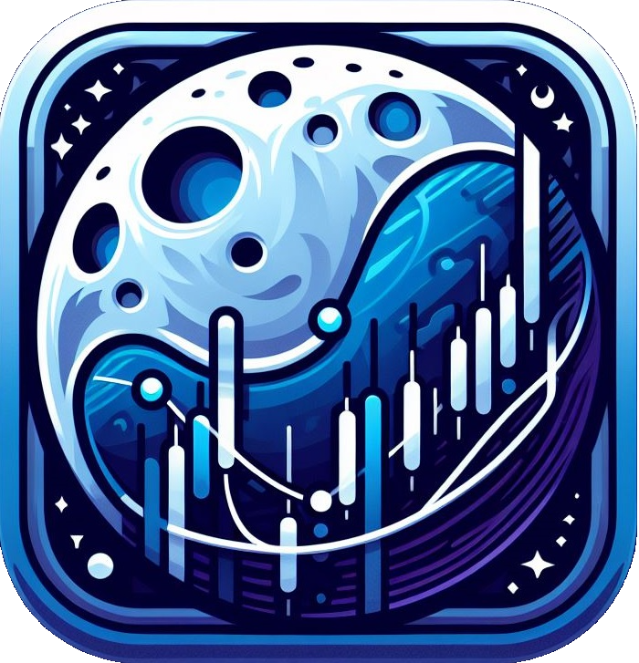

<!-- Improved compatibility of back to top link: See: https://github.com/othneildrew/Best-README-Template/pull/73 -->
<a name="readme-top"></a>
<!--
*** Thanks for checking out the Best-README-Template. If you have a suggestion
*** that would make this better, please fork the repo and create a pull request
*** or simply open an issue with the tag "enhancement".
*** Don't forget to give the project a star!
*** Thanks again! Now go create something AMAZING! :D
-->


<!-- PROJECT SHIELDS -->
<!--
*** I'm using markdown "reference style" links for readability.
*** Reference links are enclosed in brackets [ ] instead of parentheses ( ).
*** See the bottom of this document for the declaration of the reference variables
*** for contributors-url, forks-url, etc. This is an optional, concise syntax you may use.
*** https://www.markdownguide.org/basic-syntax/#reference-style-links
-->
[![Contributors][contributors-shield]][contributors-url]
[![Forks][forks-shield]][forks-url]
[![Stargazers][stars-shield]][stars-url]
[![Issues][issues-shield]][issues-url]
[![MIT License][license-shield]][license-url]
[![LinkedIn][linkedin-shield]][linkedin-url]


<!-- PROJECT LOGO -->
<br />
<div align="center">
  <a href="https://github.com/NIREKI/moon-chart">
    
  </a>

<h3 align="center">MoonCHART - track your favorite stock and crypto symbols</h3>

  <p align="center">
    <b>MoonCHART</b> is an open source mobile app for tracking the stock and cryptocurrency market. Add your favorite <b>stock symbols</b> and <b>crypto currencies</b> and gather <i>live</i> and <i>historical</i> market data. <b>MoonCHART</b> currently only supports android devices and only has German language localization.
    <br />
    <br />
    <a href="https://github.com/NIREKI/moon-chart"><strong>Explore the docs »</strong></a>
    <br />
    <br />
    <a href="https://github.com/NIREKI/moon-chart/issues">Report Bug</a>
    ·
    <a href="https://github.com/NIREKI/moon-chart/issues">Request Feature</a>
  </p>
</div>


<!-- TABLE OF CONTENTS -->
<details>
  <summary>Table of Contents</summary>
  <ol>
    <li>
      <a href="#about-the-project">About The Project</a>
      <ul>
        <li><a href="#built-with">Built With</a></li>
      </ul>
    </li>
    <li>
      <a href="#getting-started">Getting Started</a>
      <ul>
        <li><a href="#prerequisites">Prerequisites</a></li>
        <li><a href="#installation">Installation</a></li>
      </ul>
    </li>
    <li><a href="#features">Features</a></li>
    <li><a href="#roadmap">Roadmap</a></li>
    <li><a href="#contributing">Contributing</a></li>
    <li><a href="#license">License</a></li>
    <li><a href="#contact">Contact</a></li>
  </ol>
</details>


<!-- ABOUT THE PROJECT -->
## About The Project

MoonCHART was developed as part of my CS degree program with simplicity and to the point design in mind. It allows you to get a quick and easy overview of current stock and crypto prices without having to create an account or anything else. In the backend, the app uses four different APIs:
- [CoinGecko API](https://www.coingecko.com/en/api) for fetching all data related to crypto currencies
- [Finnhub API](https://finnhub.io/docs/api) for fetching live stock data and compyany details
- [Polygon.io Stock API](https://polygon.io/docs/stocks) for fetching historical stock data
- [freecurrencyapi](https://freecurrencyapi.com/) for fetching current exchange rates from usd to eur
<p align="right">(<a href="#readme-top">back to top</a>)</p>

<!-- FEATURE EXAMPLES -->
## Features
<ul>
<li>
  Homescreen showing quick and basic information for every symbol added<br>
  <details><summary>Screenshot</summary></details>
</li>
<li>
  Simply expand every symbol and see historical market data and additional data like industry and 24h high values
  <details><summary>Screenshot</summary></details>
</li>
<li>
  Quickly search for availble stocks in the <b>Nasdaq market</b> and available crypto currencies on <a href="https://www.coingecko.com/">CoinGecko</a> in one go<br>
  <details><summary>Screenshot (Search Results)</summary></details>
  <details><summary>Screenshot (Result Details)</summary></details>  

</li>
<li>
  Long-press added symbols for deleting them<br>
  <details><summary>Screenshot</summary></details>
</li>
<li>Data gets saved locally using <a href="https://www.npmjs.com/package/@react-native-async-storage/async-storage">AsyncStorage</a></li>
<li>Pull-to-Reload</li>
<li>Haptic Feedback</li>
</ul>

<p align="right">(<a href="#readme-top">back to top</a>)</p>

### Built With

* [![React Native][React-native]][React-native-url]
* [![Expo][Expo]][Expo-url]
<p align="right">(<a href="#readme-top">back to top</a>)</p>


<!-- GETTING STARTED -->
## Getting Started

To get a local copy up and running follow these simple example steps:

### Prerequisites

First, check if you meet these prerequisites:
* Use an code editor of your choice, eg [Visual Studio Code](https://vscode.dev)
* Check if node.js and npm is installed, you can follow the [Expo installation guide](https://docs.expo.dev/get-started/installation/).
* Create all neccessary free API keys
  * [CoinGecko API](https://www.coingecko.com/en/api) for fetching all data related to crypto currencies
  * [Finnhub API](https://finnhub.io/docs/api) for fetching live stock data and compyany details
  * [Polygon.io Stock API](https://polygon.io/docs/stocks) for fetching historical stock data
  * [freecurrencyapi](https://freecurrencyapi.com/) for fetching current exchange rates from usd to eur

### Installation

1. Clone the git repo
   ```sh
   git clone https://github.com/NIREKI/moon-chart.git
   ```
2. Enter API Keys into `example.env` and rename `example.env` to `.env`
3. Install NPM packages
   ```sh
   npm install --force
   ```
   It's neccessary to use `--force` because of incompatible dependencies between `react-native-svg` and `react-native-svg-charts`, see [this GitHub Issue](https://github.com/JesperLekland/react-native-svg-charts/issues/608). 
4. Startup the app with `npx expo start`. Please note that the app currently only supports android devices.

<p align="right">(<a href="#readme-top">back to top</a>)</p>

<!-- ROADMAP -->
## Roadmap

- [x] Compatibility for Stock and Cryptocurrencies
- [x] Search function
- [x] Saving Data locally
- [ ] Show trending stock and crypto when opening search function
- [ ] Localization for languages other than German

See the [open issues](https://github.com/NIREKI/moon-chart/issues) for a full list of proposed features (and known issues).

<p align="right">(<a href="#readme-top">back to top</a>)</p>


<!-- CONTRIBUTING -->
## Contributing

Contributions are what make the open source community such an amazing place to learn, inspire, and create. Any contributions you make are **greatly appreciated**.

If you have a suggestion that would make this better, please fork the repo and create a pull request. You can also simply open an issue with the tag "enhancement".
Don't forget to give the project a star! Thanks again!

1. Fork the Project
2. Create your Feature Branch (`git checkout -b feature/AmazingFeature`)
3. Commit your Changes (`git commit -m 'Add some AmazingFeature'`)
4. Push to the Branch (`git push origin feature/AmazingFeature`)
5. Open a Pull Request

<p align="right">(<a href="#readme-top">back to top</a>)</p>


<!-- LICENSE -->
## License

Distributed under the MIT License. See `LICENSE` for more information.

<p align="right">(<a href="#readme-top">back to top</a>)</p>


<!-- CONTACT -->
## Contact

Niklas Kinze

[![Discord][Discord]][Discord-url]
[![Reddit][Reddit]][Reddit-url]
[![LinkedIn][linkedin-shield]][linkedin-url]
[![Xing][Xing]][Xing-url]
[![Twitter][Twitter]][Twitter-url]
[![Steam][Steam]][Steam-url]

Project Link: [https://github.com/NIREKI/moon-chart](https://github.com/NIREKI/moon-chart)

<p align="right">(<a href="#readme-top">back to top</a>)</p>


<!-- MARKDOWN LINKS & IMAGES -->
<!-- https://www.markdownguide.org/basic-syntax/#reference-style-links -->
[contributors-shield]: https://img.shields.io/github/contributors/NIREKI/moon-chart.svg?style=for-the-badge
[contributors-url]: https://github.com/NIREKI/moon-chart/graphs/contributors
[forks-shield]: https://img.shields.io/github/forks/NIREKI/moon-chart.svg?style=for-the-badge
[forks-url]: https://github.com/NIREKI/moon-chart/network/members
[stars-shield]: https://img.shields.io/github/stars/NIREKI/moon-chart.svg?style=for-the-badge
[stars-url]: https://github.com/NIREKI/moon-chart/stargazers
[issues-shield]: https://img.shields.io/github/issues/NIREKI/moon-chart.svg?style=for-the-badge
[issues-url]: https://github.com/NIREKI/moon-chart/issues
[license-shield]: https://img.shields.io/github/license/NIREKI/moon-chart.svg?style=for-the-badge
[license-url]: https://github.com/NIREKI/moon-chart/blob/master/LICENSE
[linkedin-shield]: https://img.shields.io/badge/-LinkedIn-black.svg?style=for-the-badge&logo=linkedin&colorB=555
[linkedin-url]: https://linkedin.com/in/niklaskinze
[React-native]: https://img.shields.io/badge/React%20Native-20232A?style=for-the-badge&logo=React&logoColor=%2361DAFB
[React-native-url]: https://reactnative.dev/
[Discord]: https://img.shields.io/badge/Discord-%235865F2.svg?style=for-the-badge&logo=discord&logoColor=white 
[Discord-url]: [https://reactnative.dev/](https://discordapp.com/users/291618717358620672)
[Reddit]: https://img.shields.io/badge/Reddit-FF4500?style=for-the-badge&logo=reddit&logoColor=white
[Reddit-url]: https://www.reddit.com/user/NIREKII/
[Xing]: https://img.shields.io/badge/xing-%23006567.svg?style=for-the-badge&logo=xing&logoColor=white
[Xing-url]: https://www.xing.com/profile/Niklas_Kinze
[Twitter]: https://img.shields.io/badge/X-%23000000.svg?style=for-the-badge&logo=X&logoColor=white
[Twitter-url]: https://twitter.com/e1447c7c350744b
[Steam]: https://img.shields.io/badge/Steam-777777?style=for-the-badge&logo=Steam&logoColor=%23000000
[Steam-url]: https://steamcommunity.com/id/nirekiki/
[Expo]: https://img.shields.io/badge/Expo-ffffff?style=for-the-badge&logo=Expo&logoColor=%23000020
[Expo-url]: https://expo.dev/
